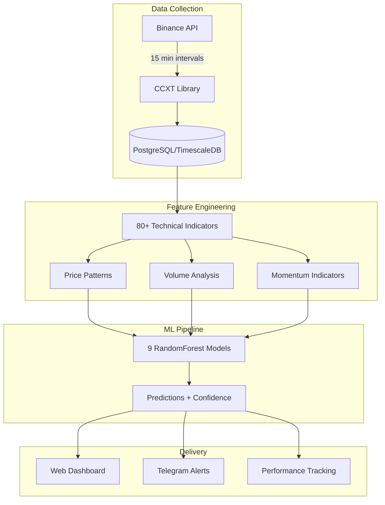
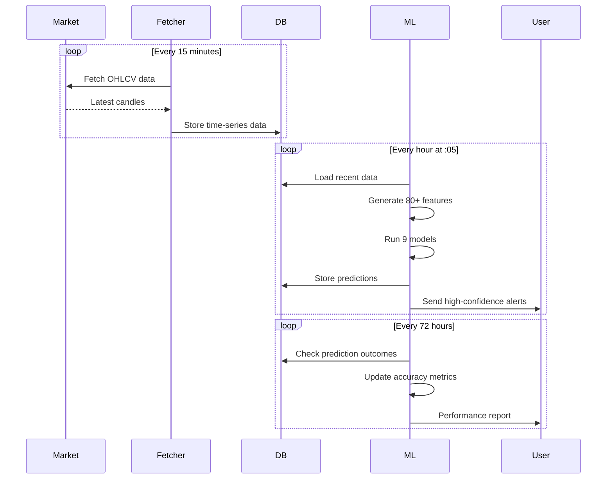
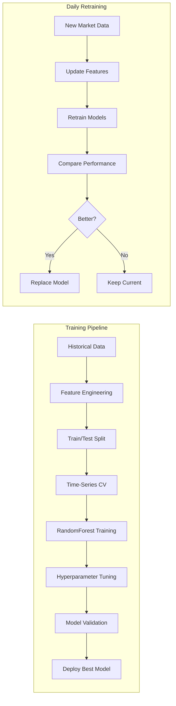

<div align="center">
  
  
  # BSE Predict
  
  **Multi-Target Cryptocurrency Price Prediction System**
  
  [](https://www.bse-predict.com)
  
  🎯 Predicts ±1%, ±2%, and ±5% price movements for BTC, ETH, and SOL using machine learning
</div>

## 🧠 Why BSE Predict?

### The Challenge
Cryptocurrency markets move 24/7 with extreme volatility. Traditional technical analysis often fails because:
- Markets are driven by sentiment, news, and whale movements
- Human traders can't monitor multiple timeframes continuously
- Emotional decisions lead to poor timing
- Most indicators are lagging, not predictive

### Our Solution
BSE Predict uses **machine learning** to find patterns humans miss:
- Analyzes 80+ technical indicators simultaneously
- Learns from historical price movements and outcomes
- Makes emotionless, data-driven predictions
- Runs 24/7 without fatigue or bias
- Adapts daily to changing market conditions

### The Science
Our approach is based on **ensemble learning** with RandomForest classifiers:
- **Feature Engineering**: Transform raw OHLCV data into 80+ meaningful features (RSI, MACD, Bollinger Bands, volume patterns, etc.)
- **Binary Classification**: Frame prediction as "Will price hit +X% or -X% first?" - a simpler, more reliable question than exact price prediction
- **Time-Series Cross-Validation**: Prevent future data leakage with proper temporal splits
- **Multi-Target Strategy**: Different models for different volatility levels (±1%, ±2%, ±5%)
- **Confidence Scoring**: Only alert on high-confidence predictions (>75%)

## ✨ Key Features

- **9 Specialized ML Models**: 3 assets × 3 target levels = comprehensive coverage
- **Hourly Predictions**: Automated predictions with confidence scores every hour at :05
- **Real Performance Tracking**: 72-hour outcome monitoring with accuracy metrics
- **Telegram Alerts**: High-confidence signals (>75%) delivered instantly
- **Auto-Retraining**: Models update daily with latest market data
- **Web Dashboard**: Real-time monitoring at [bse-predict.com](https://www.bse-predict.com)
- **Self-Healing**: Automatic data gap detection and recovery

## 🎯 How It Works

### System Architecture



### Prediction Flow



**Prediction Strategy**: Each model answers "Which target will be hit FIRST: +X% or -X%?" within 72 hours

| Asset | ±1% Model | ±2% Model | ±5% Model | Use Case |
|-------|-----------|-----------|-----------|----------|
| **BTC** | High frequency | Balanced | Major moves | Day trading → Swing trading |
| **ETH** | Short-term | Mid-term | Volatility spikes | Scalping → Position trading |
| **SOL** | Rapid changes | Trending | Large swings | High-risk → Lower-risk |

## 📊 Performance & Accuracy

### Model Training Process



**Realistic Expectations**:
- 55-65% accuracy is considered good (markets are inherently noisy)
- Even 52% accuracy can be profitable with proper risk management  
- Focus on high-confidence predictions (>75% confidence)
- Models show higher precision (60%+) than recall - conservative but reliable

### Why These Numbers Matter
- **Random guessing** = 50% accuracy
- **52% accuracy** with proper position sizing = profitable over time
- **60% precision** means when model says "UP", it's right 6/10 times
- **High confidence (>75%)** predictions have even better success rates


## 🏗️ Tech Stack

- **ML**: Python, scikit-learn (RandomForest), 80+ engineered features
- **Database**: PostgreSQL + TimescaleDB for optimized time-series storage
- **Backend**: FastAPI with WebSocket support
- **Frontend**: React + TypeScript dashboard at [bse-predict.com](https://www.bse-predict.com)
- **Infrastructure**: Docker, Nginx, automated scheduling
- **Notifications**: Telegram bot for real-time alerts

## ⏰ Automated Operations

- **Hourly**: Predictions at :05, outcome tracking, high-confidence alerts
- **Daily**: Model retraining (06:00 UTC), performance report (18:00 UTC)
- **Continuous**: Data collection every 15 minutes, 72-hour prediction monitoring


## 🚀 Quick Start

```bash
# 1. Clone and prepare
git clone <repository-url>
cd bse-predict
make prepare

# 2. Configure Telegram (optional)
cp config.yaml.example config.yaml
# Edit config.yaml with your Telegram bot token and chat ID

# 3. Run with dashboard
make run

# 4. Access dashboard
open http://localhost:3000
```

**That's it!** The system will automatically:
- Start PostgreSQL/TimescaleDB
- Fetch historical data
- Train ML models
- Begin hourly predictions
- Display results in the dashboard

## 🔧 Configuration

**Required**: Edit `config.yaml` to add your Telegram credentials:
```yaml
telegram:
  bot_token: "YOUR_BOT_TOKEN"  # Get from @BotFather
  chat_id: "YOUR_CHAT_ID"      # Get from @userinfobot
```

**Optional**: Adjust prediction targets and assets:
```yaml
trading:
  assets: ["BTC/USDT", "ETH/USDT", "SOL/USDT"]
  target_percentages: [0.01, 0.02, 0.05]  # 1%, 2%, 5%
```

## 🕹️ Commands

```bash
make run        # Start the system with dashboard
make stop       # Stop all services
make test       # Run test suite
make health     # Check system health
make logs       # View logs
make predict    # Run manual prediction
make backup     # Backup database
```

## 🐳 Production Deployment

```bash
# Deploy to VPS (requires Docker on target)
make deploy VPS_IP=your.server.ip
```

The dashboard will be available at `http://your-server-ip:3000`

## 🔍 Troubleshooting

- **Dashboard offline?** Check Docker logs: `docker logs bse-predict-dashboard-backend`
- **No predictions?** Verify Telegram config in `config.yaml`
- **Database issues?** Run `make health` to diagnose
- **Missing data?** System auto-recovers, or run `make run` to refetch

## 💡 Project Philosophy

### Why We Built This
BSE Predict started as an experiment to answer a simple question: **Can machine learning consistently predict short-term crypto price movements better than random chance?**

The answer is **yes, but with nuance**:
- Models can achieve 55-65% accuracy (better than 50% random)
- Success requires proper feature engineering and model selection
- Daily retraining is essential to adapt to market changes
- High-confidence predictions (>75%) are the most valuable signals

### What We Learned
1. **Simplicity wins**: Binary classification (up/down) beats complex price prediction
2. **Multiple targets matter**: Different traders need different timeframes
3. **Automation is key**: Humans can't monitor 24/7, machines can
4. **Transparency builds trust**: Show real performance, not just backtests
5. **Conservative is profitable**: Better to miss trades than take bad ones

### Open Source Benefits
We believe in open source because:
- **Transparency**: See exactly how predictions are made
- **Improvement**: Community can contribute and enhance
- **Education**: Learn from real-world ML implementation
- **Trust**: No black box - all code is auditable

## ⚠️ Disclaimer

Educational purposes only. Cryptocurrency trading involves substantial risk. Past performance does not guarantee future results. This is not financial advice.

---

<div align="center">
  
**Visit [bse-predict.com](https://www.bse-predict.com) for live predictions**

Vibe coded with Claude

</div>
